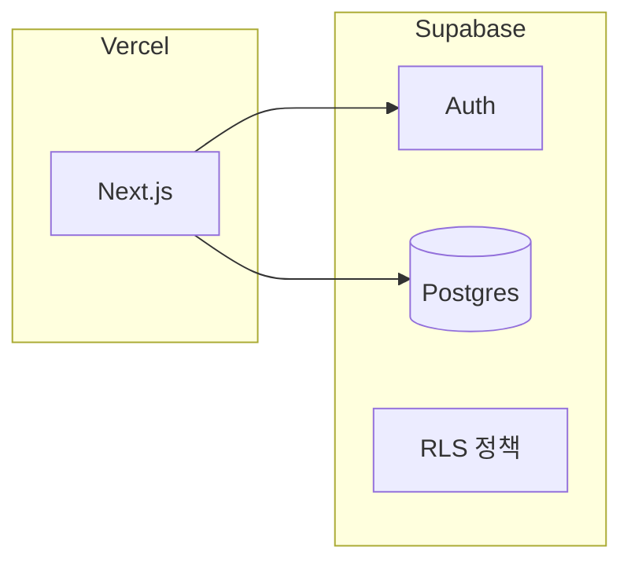

# Togetall — 기술 스택 & 저장소 구조 (초안)

## React Native vs Next.js (한 줄)

| | **Next.js** (이번 선택) | **React Native** (문서 초안에만 있었음) |
|---|------------------------|----------------------------------------|
| 결과물 | **웹** (브라우저, URL 공유 용이) | **iOS/Android 앱** (앱 스토어 배포) |
| 배포 | Vercel 등 | 앱 스토어 / Expo |
| 익숙함 | HTML/CSS 반응형·웹 접근성과 동일 맥락 | 모바일 전용 API·네비게이션 패턴 별도 학습 |

PRD·와이어의 화면 구조는 **모바일 뷰포트 기준 웹**으로 구현하면 그대로 따를 수 있다.

## 선정 스택 (MVP)

| 영역 | 선택 | 이유 |
|------|------|------|
| 프레임워크 | **Next.js (App Router)** | React 단일 스택, 라우팅·SEO·API Route 한 프로젝트에서 처리 |
| 호스팅 | **Vercel** | Next.js와 통합, 프리뷰·환경 변수 관리 단순 |
| 스타일 | **선택** (Tailwind CSS 등) | 웹 퍼블리셔 경력과 맞춤 |
| 백엔드·DB | **Supabase** (권장) | Postgres, 인증, RLS, Storage — 서버리스와 궁합 좋음 |
| 언어 | **TypeScript** | 타입 안정성 |

대안: **Vercel Postgres** + **Auth.js(NextAuth)** 등으로 전부 Vercel 생태계만 쓸 수도 있다. MVP 속도는 Supabase가 보통 유리하다.

## 아키텍처 개요



- **데이터**: 사용자·게시글·댓글·신고는 Postgres 테이블로 모델링.
- **보안**: Supabase RLS 또는 서버에서만 호출하는 API로 “본인만 수정”, “공개 글만 읽기” 적용.
- **푸시**: 웹은 **Web Push**(Phase 2) 또는 이메일 알림으로 시작 가능.

## 저장소 디렉터리

```
Togetall/
├── web/                  # Next.js 앱 (App Router, `src/app`)
├── supabase/migrations/  # Postgres·RLS 마이그레이션 SQL
├── docs/                 # PRD, 비전, 와이어, 결정, Supabase 설정
└── README.md
```

로컬 실행·배포는 [README.md](../README.md)와 [SUPABASE_SETUP.md](./SUPABASE_SETUP.md)를 따른다.

## 환경 변수 (구현 시)

- `NEXT_PUBLIC_SUPABASE_URL`
- `NEXT_PUBLIC_SUPABASE_ANON_KEY`

서버 전용 시크릿(Service Role 등)은 **서버 컴포넌트·Route Handler·Server Actions**에만 두고, 클라이언트 번들에 넣지 않는다.

---

*PRD와 요구사항은 [PRD.md](./PRD.md)를 기준으로 한다.*
