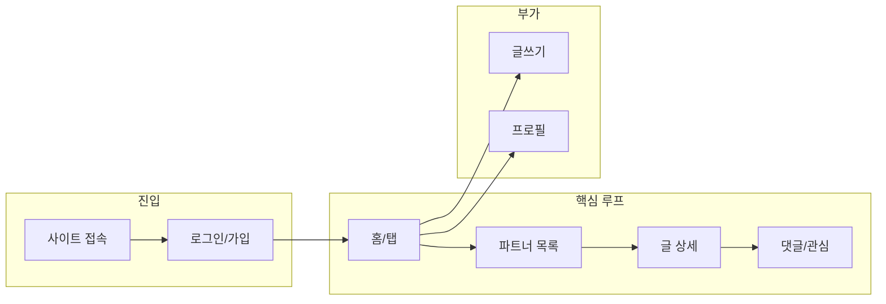

# Togetall — 와이어프레임 & 사용자 플로우

텍스트 와이어(ASCII). 실제 픽셀 디자인 전 **정보 구조·플로우** 확인용이다. **모바일 브라우저(반응형 웹)** 기준이며, 하단 탭은 웹에서도 흔히 쓰는 내비 패턴으로 구현하면 된다.

---

## 사용자 플로우 (요약)



---

## 화면 1 — 로그인 / 가입

```
┌─────────────────────────────┐
│  Togetall                    │
│                              │
│     [ 이메일 입력        ]     │
│     [ 비밀번호           ]     │
│                              │
│     [        로그인        ]   │
│     [      소셜 로그인      ]   │
│                              │
│     계정이 없나요? [가입]     │
└─────────────────────────────┘
```

**행동**: 로그인 성공 시 홈(탭)으로 이동.

---

## 화면 2 — 홈 (탭 바닥)

```
┌─────────────────────────────┐
│ ≡  Togetall          🔔 · 👤  │
├─────────────────────────────┤
│  함께 뛰어요 · 오늘의 글      │
│  ┌─────┐ ┌─────┐ ┌─────┐     │
│  │카드1│ │카드2│ │카드3│ →  │
│  └─────┘ └─────┘ └─────┘     │
│                              │
│  [ 파트너 ] [ 크루 ] [ 전체 ]  │  ← 세그먼트 또는 필터
├─────────────────────────────┤
│  🏠      🔍       ✏️       👤  │
│ 홈     탐색      글쓰기   내정보│
└─────────────────────────────┘
```

**행동**: 탭으로 탐색·글쓰기·프로필 이동. 카드 탭 시 글 상세.

---

## 화면 3 — 파트너 탐색 (목록)

```
┌─────────────────────────────┐
│  ←  파트너 찾기              │
├─────────────────────────────┤
│  [지역 ▼] [종목 ▼] [검색…]   │
├─────────────────────────────┤
│  ▪ 저녁 7시 한강 러닝 5km    │
│    강남구 · 중급 · 댓글 3    │
│  ─────────────────────────   │
│  ▪ 주말 오전 크루 모집       │
│    마포구 · 페이스 6분대     │
│  ─────────────────────────   │
│  ▪ ...                       │
│                         [+]  │  ← 빠른 글쓰기 FAB(선택)
└─────────────────────────────┘
```

**행동**: 행 탭 → 글 상세. 필터 변경 → 목록 갱신.

---

## 화면 4 — 글 상세 (파트너 또는 크루 모집)

```
┌─────────────────────────────┐
│  ←                    ⋮ 신고 │
├─────────────────────────────┤
│  저녁 7시 한강 러닝 5km      │
│  파트너 · 강남구             │
├─────────────────────────────┤
│  본문 텍스트 영역…           │
│  일정: 월수금 19:00          │
│  페이스: 6:30/km 안내        │
├─────────────────────────────┤
│  👤 민지  ·  프로필 보기 >   │
├─────────────────────────────┤
│  댓글 3                      │
│  · 사용자B: 저 참여 가능해요  │
│  · 사용자C: …                │
│  [ 댓글을 입력하세요    ] [전송]│
├─────────────────────────────┤
│  [ ♡ 관심 ]  (또는 좋아요만)   │
└─────────────────────────────┘
```

**행동**: 프로필 이동, 댓글, 관심, 신고.

---

## 화면 5 — 크루 모집 상세

파트너 상세와 **동일 레이아웃**을 재사용하고, 상단에 **배지**만 다르게 한다.

```
┌─────────────────────────────┐
│  ←                    ⋮ 신고 │
├─────────────────────────────┤
│  [크루 모집] 주말 한강 크루   │
│  마포구 · 매주 토 7시        │
├─────────────────────────────┤
│  본문… 연락: (정책에 따름)   │
└─────────────────────────────┘
```

---

## 화면 6 — 글쓰기

```
┌─────────────────────────────┐
│  취소    새 글        등록   │
├─────────────────────────────┤
│  유형: ( ) 파트너 ( ) 크루   │
│        ( ) 자유              │
├─────────────────────────────┤
│  제목 [                    ] │
│  지역 [ 시·구 선택      ▼ ]  │
│  종목 [                    ] │
├─────────────────────────────┤
│  본문                        │
│  ┌─────────────────────┐    │
│  │                     │    │
│  │                     │    │
│  └─────────────────────┘    │
└─────────────────────────────┘
```

**행동**: 등록 → 목록 또는 상세로 이동.

---

## 화면 7 — 프로필 (내 정보)

```
┌─────────────────────────────┐
│  ←  내 프로필        [편집]  │
├─────────────────────────────┤
│        ( 아바타 )            │
│        닉네임                │
│        강남구 · 러닝 · 중급   │
├─────────────────────────────┤
│  내가 쓴 글                  │
│  · 글 제목 …                 │
│  · 글 제목 …                 │
├─────────────────────────────┤
│  설정 · 로그아웃 · 안전 가이드│
└─────────────────────────────┘
```

---

## 화면 8 — 커뮤니티 피드 (선택 탭 또는 홈과 통합)

홈과 통합할 경우 **화면 2** 한 개로 줄일 수 있다. 분리할 경우:

```
┌─────────────────────────────┐
│  커뮤니티                    │
├─────────────────────────────┤
│  최신순 · 인기순(Phase2)     │
│  ┌─────────────────────┐    │
│  │ 운동 질문 카드       │    │
│  └─────────────────────┘    │
│  ┌─────────────────────┐    │
│  │ 후기 카드            │    │
│  └─────────────────────┘    │
└─────────────────────────────┘
```

---

## 화면 수 정리

| # | 화면 | MVP 포함 |
|---|------|----------|
| 1 | 로그인/가입 | 예 |
| 2 | 홈(탭) | 예 |
| 3 | 파트너 목록 | 예 |
| 4 | 글 상세 | 예 |
| 5 | 크루 상세 | 예 (4와 동일 컴포넌트 권장) |
| 6 | 글쓰기 | 예 |
| 7 | 프로필 | 예 |
| 8 | 커뮤니티 전용 피드 | 선택(홈과 통합 가능) |

총 **핵심 7화면**(5번은 4번 재사용 시 6~7개 화면)으로 MVP를 구성할 수 있다.
